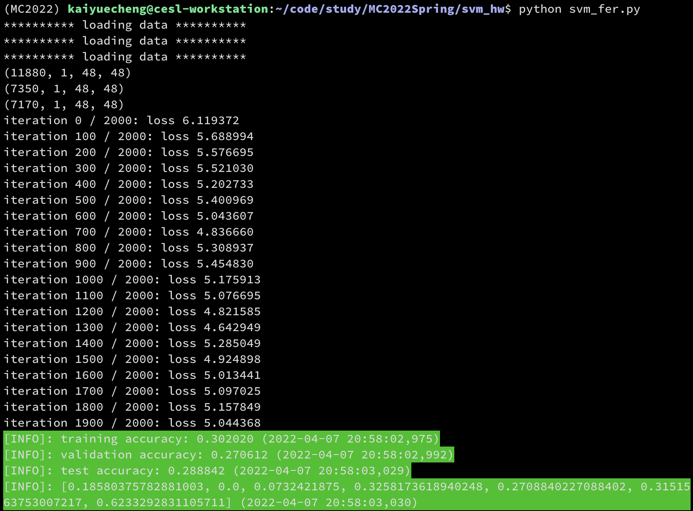
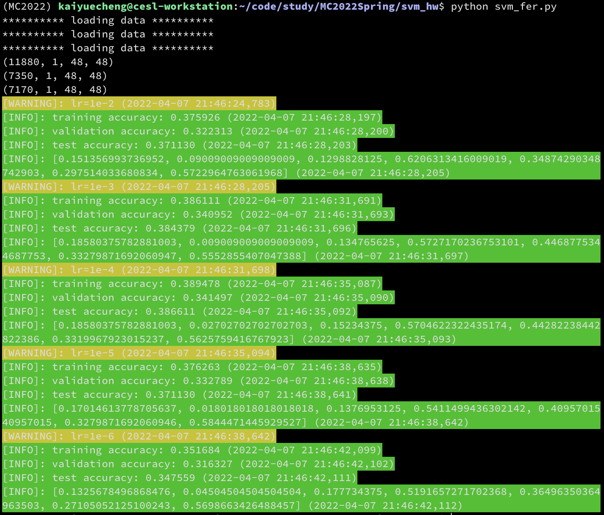
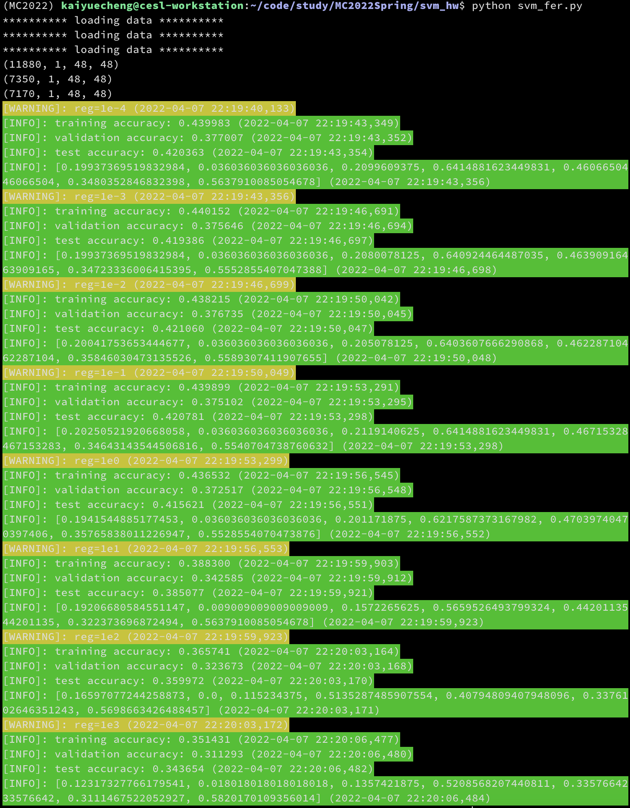
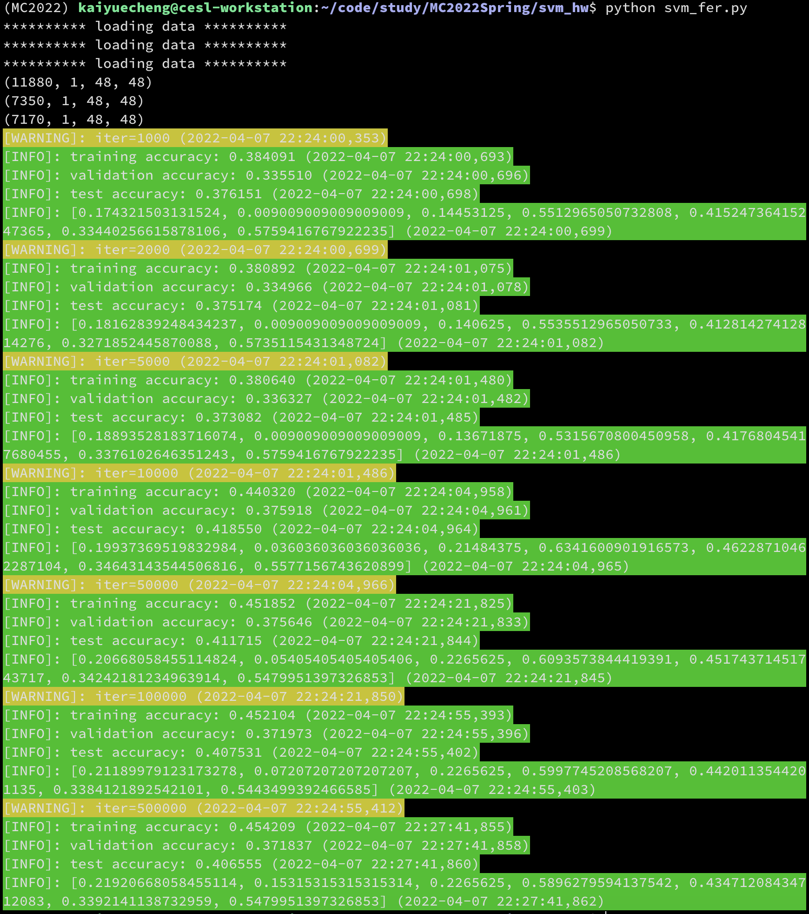
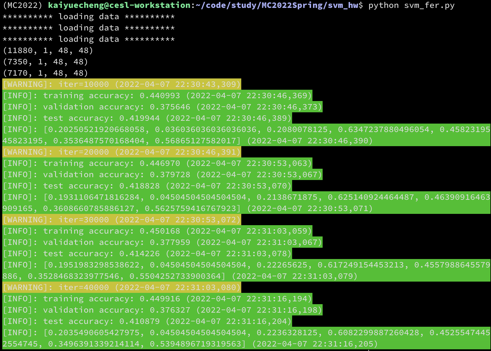
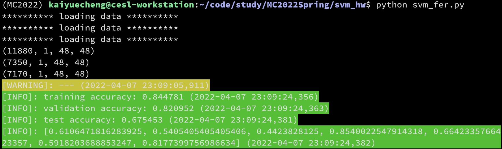
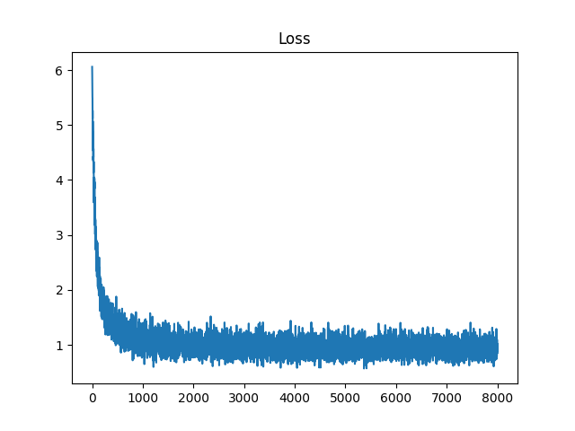

# MC2022Spring-SVM

## 第1题 完成loss函数和梯度计算

```python
batch_size, _ = X_batch.shape

pred_score = np.dot(X_batch, self.W)
crt_rows = np.arange(batch_size).reshape(batch_size, 1)
crt_cols = y_batch.reshape(batch_size, 1)
crt_score = pred_score[crt_rows, crt_cols]

margin = np.maximum(0, pred_score-crt_score+1)
margin[crt_rows, crt_cols] = 0

loss = 0.5*reg*np.sum(self.W*self.W) + (np.sum(margin)) / batch_size

margin[margin>0] = 1
margin[crt_rows, crt_cols] = -np.sum(margin, axis=1).reshape(batch_size, 1)

dW = np.dot(np.transpose(X_batch), margin) / batch_size + reg * self.W
```

用矩阵的方式进行计算，效率更高。

## 第2题 直接分类

默认参数：`learning_rate=1.e-5, reg=1.e1, num_iters=2000`

准确率

| 数据集 | 准确率 |
| ------ | ------ |
| Train  | 30.20% |
| Valid  | 27.06% |
| Test   | 28.88% |



## 第3题 HOG特征参数设计

### 3.1 修改learning_rate

实验条件：固定`reg=1.e1, num_iters=10000`

| Learning Rate | 1e-2   | 1e-3   | 1e-4   | 1e-5   | 1e-6   |
| ------------- | ------ | ------ | ------ | ------ | ------ |
| Train Acc     | 37.59% | 38.61% | 38.95% | 37.63% | 35.17% |
| Valid Acc     | 32.23% | 34.10% | 34.15% | 33.28% | 31.63% |

可见在`learning_rate=1e-4`时有最佳效果，学习率过高或过低都会使得准确率降低。



### 3.2 修改reg

实验条件：固定`learning_rate=1e-4, num_iters=10000`

| Reg       | 1e-4   | 1e-3   | 1e-2   | 1e-1   | 1e0    | 1e1    | 1e2    | 1e3    |
| --------- | ------ | ------ | ------ | ------ | ------ | ------ | ------ | ------ |
| Train Acc | 44.00% | 44.02% | 43.82% | 43.99% | 43.65% | 38.83% | 36.57% | 35.14% |
| Valid Acc | 37.70% | 37.56% | 37.67% | 37.51% | 37.25% | 34.26% | 32.37% | 31.13% |

可见在`reg=1e-2`时有最佳效果。



### 3.3 修改num iters

实验条件：固定`learning_rate=1e-4, reg=1e-2`

| Iter Num  | 1000   | 2000   | 5000   | 10000  | 50000  | 100000 | 500000 |
| --------- | ------ | ------ | ------ | ------ | ------ | ------ | ------ |
| Train Acc | 38.41% | 38.09% | 38.06% | 44.03% | 45.19% | 45.21% | 45.42% |
| Valid Acc | 33.55% | 33.50% | 33.63% | 37.59% | 37.56% | 37.20% | 37.18% |

可见`num_iters`在10000到50000之间有一个最佳值，随着迭代次数的增加，训练集上的准确率越来越高，但验证集上的准确率不升反降，说明出现了过拟合。



现进行进一步实验寻找最佳迭代次数。

| Iter Num  | 10000  | 20000  | 30000  | 40000  |
| --------- | ------ | ------ | ------ | ------ |
| Train Acc | 44.10% | 44.70% | 45.02% | 45.00% |
| Valid Acc | 37.56% | 37.97% | 37.80% | 37.63% |

可见最佳迭代次数为20000。



### 3.4 最佳参数组合

```
learning_rate = 1.e-4
reg = 1.e-2
num_iters = 20000
```

测试集上准确率：**Test_Acc = 41.88%**

类别准确率：

|      | angry  | disgust | fear   | happy  | neutral | sad    | surprise |
| ---- | ------ | ------- | ------ | ------ | ------- | ------ | -------- |
| Acc  | 19.31% | 4.50%   | 21.39% | 62.51% | 46.39%  | 36.08% | 56.26%   |

## 4 ResNet18 Feature

### 4.1 最佳参数

```
learning_rate = 1.e-4
reg = 1e.0
num_iters = 8000
```

### 4.2 测试结果



测试集上准确率：**Test_Acc = 67.55%**

类别准确率：

|      | angry  | disgust | fear   | happy  | neutral | sad    | surprise |
| ---- | ------ | ------- | ------ | ------ | ------- | ------ | -------- |
| Acc  | 61.06% | 54.05%  | 44.24% | 85.40% | 66.42%  | 59.18% | 81.77%   |

loss曲线



### 4.3 提高性能的方法

- 训练时采用动态learning rate
- 样本均衡，即抽取每个batch时每个类别中的样本数量差距不大
- 使用核函数，增强其非线性的性能

